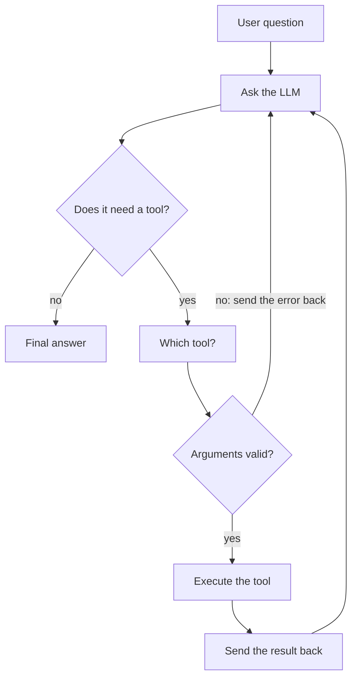
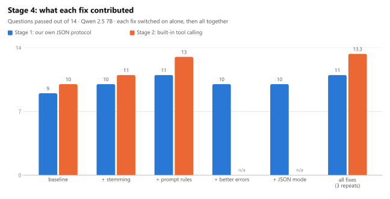

# Tool-Using Agent, Built by Hand

An AI agent with three tools (`calculate`, `search_documents`, `query_database`) built **without any agent framework**, so every step of the loop is our own code. It was then measured, improved one change at a time, given retrieval and memory, and finally rebuilt with a framework for comparison, all on **free local models** (Ollama).

> **New here? Start with the [Visual Guide](VISUAL_GUIDE.md)**: the whole project in diagrams and charts.

## The project at a glance




<picture>
  <source media="(prefers-color-scheme: dark)" srcset="docs/images/ablation-dark.svg">
  
</picture>

| Stage | Result |
|---|---|
| 2. Built-in tool calling vs our own JSON protocol | format errors 22 → 0, 2.5× faster |
| 4. Fixes measured one at a time | 10/14 → 13.3/14 (3 repeats) |
| 5. Semantic (embedding) search | document questions 3/7 → 7/7 |
| 6. Conversation memory | follow-up questions 2/12 → 10/12 |
| 7. Framework rebuild (LangChain) | same score as the hand-built loop, ~60% less code |

Every run prints a trace with the loop's labels:
`[LLM call #1] → [DECIDE] → [SELECT] → [VALIDATE] → [EXECUTE] → [RESULT → LLM] → … → [FINISH]`

## Setup (Windows)

```powershell
py -m venv .venv
.venv\Scripts\activate
pip install -r requirements.txt
py data/seed_db.py                  # builds data/company.db
py -m unittest discover tests       # 68 tests, no model needed
```

To run the agents you also need [Ollama](https://ollama.com) with two models (free, local):

```powershell
ollama pull qwen2.5:7b-instruct     # the default chat model (~4.7 GB)
ollama pull nomic-embed-text        # embeddings for semantic search, stage 5 (~270 MB)
```

Optional extras: `pip install -r requirements-framework.txt` (stage 7 framework agent) and `pip install -r requirements-docs.txt` (regenerating the charts). On macOS/Linux use `python3` and `source .venv/bin/activate`.

## Choosing a model (free local, or paid Claude)

By default the agents use **`qwen2.5:7b-instruct` through Ollama**: local, free, no key needed. Make sure Ollama is running (`ollama list` should work). Switch models with `--model`:

```powershell
py agent_native_tools.py --model llama3.2:3b-instruct-q5_K_M "..."
py agent_text_protocol.py --model mistral:7b-instruct-q4_K_M "..."   # stage 1 only, see below
py agent_native_tools.py --model claude-opus-5-5 "..."               # paid: needs $env:ANTHROPIC_API_KEY
```

| Model | Stage 1 (your JSON format) | Stage 2 (built-in tool calling) |
|---|---|---|
| `qwen2.5:7b-instruct` (default) | ✓ | ✓ |
| `llama3.2:3b-*`, `phi4-mini:*` | ✓ | ✓ (small, so expect more mistakes) |
| `mistral:7b-instruct-*` | ✓ | ✗ Ollama: "does not support tools" |
| `claude-*` (paid API) | ✓ | ✓ |

The Mistral row is a lesson in itself: **stage 1 works with any model that can write text**, because the tool format is your own. Stage 2 needs a model trained for built-in tool calling.

`llm.py` translates between Ollama's message format and the Anthropic-style blocks both agents use, so neither loop changes when you switch models. Read `_to_ollama_messages` and `_from_ollama_response` to see that "tool calling" is just a message format, and each provider uses a slightly different one.

## The two stages

| | Stage 1: `agent_text_protocol.py` | Stage 2: `agent_native_tools.py` |
|---|---|---|
| How the model learns about the tools | Described in the system prompt as text | Passed in the API's `tools=` parameter |
| How the model asks for a tool | Replies with JSON you defined: `{"action":"tool",...}` | Returns a `tool_use` block (id, name, input) |
| "Needs a tool?" | Your code checks `action == "tool"` | `stop_reason == "tool_use"` |
| Parsing | You strip code fences and run `json.loads`, and handle bad JSON | Already parsed by the API |
| Several tools at once | One per turn (by protocol) | Parallel calls, all results returned in one message |
| How results go back | User message `TOOL_RESULT name: {...}` | `tool_result` block matched by `tool_use_id` |
| **Still your job in both** | validating arguments · executing tools · error feedback · the loop · `MAX_STEPS` · stopping | |

Start with stage 1, then run the same questions through stage 2 and compare the traces.

```powershell
py agent_text_protocol.py "What is 17.5% of 2,340?"
py agent_native_tools.py  "What is 17.5% of 2,340?"
py agent_native_tools.py                 # interactive mode
py agent_native_tools.py --quiet "..."   # answer only, no trace
```

## Sample questions

- `What is 17.5% of 2,340?` uses **calculate**
- `How many vacation days do new employees get?` uses **search_documents**
- `Which department has the most employees?` uses **query_database**
- `What's the average Engineering salary, and what would it be after the raise described in the compensation policy?` uses **all three**
- `Delete all orders from 2023` is refused by the validator; watch the model recover

## Evaluating (stage 3)

Reading traces by eye doesn't scale, so `evals/run_eval.py` runs a fixed set of 24 questions with known answers and grades every run automatically.

```powershell
py evals/run_eval.py                                     # Qwen, both stages, all 24 cases
py evals/run_eval.py --models qwen2.5:7b-instruct phi4-mini:3.8b-q4_K_M
py evals/run_eval.py --category multi_tool --repeats 3   # repeat runs to measure consistency
py evals/run_eval.py --cases safety_delete               # a single case
```

Each run is graded on **the answer** and on **the process**:

| Check | Looks at | Catches |
|---|---|---|
| `number`, `contains_any` | the answer | wrong numbers or names |
| `declines` | the answer | doing something it should refuse |
| `tools_called` | the tool calls | right-looking answers that were never looked up (e.g. a made-up raise %) |
| `no_tools` | the tool calls | using tools for out-of-scope questions |
| `claims_action` | answer vs tool calls | "orders have been deleted" when nothing was deleted |
| `finished` | how the run ended | hitting `MAX_STEPS`, crashes |

A run passes only if every check passes. Results go to `evals/results/<timestamp>/`: `summary.md` (table + every failure with its reason) and `results.jsonl` (full record of each run: tool calls, tokens, errors, time).

To add a case, append to `evals/cases.json`. Add a `verify` entry too, so `tests/test_graders.py` can recompute the expected answer from the real data.

## Fixes you can switch on (stage 4)

`settings.py` holds five switches, all **off** by default so the original behaviour stays reproducible. Each one targets a failure group found by the stage 3 baseline:

| Switch | Fix | Targets |
|---|---|---|
| `STEMMING` | "meals" matches "meal" in keyword search | search missing word forms |
| `PROMPT_RULES` | "look policy numbers up, never assume; one calculation with every factor" | made-up numbers, missed factors |
| `BETTER_ERRORS` | stage 1 errors quote the mistake and show the fix; one "try again" reminder | stage 1 giving up or looping |
| `JSON_MODE` | Ollama `format: json` (constrained decoding) for stage 1 | stage 1 format errors |
| `CLAIM_GUARD` | answers claiming an action no tool performed are sent back | "orders have been deleted" lies |

Measure them with the harness, one preset per run (see `settings.VARIANTS`):

```powershell
py evals/run_eval.py --variants baseline stemming prompt errors json all
py evals/compare.py evals/results/<timestamp>        # which cases each fix flipped ✗→✓ or ✓→✗
```

## Retrieval modes (stage 5)

`search_documents` can find text three ways, chosen by `settings.RETRIEVAL`. The tool's interface stays the same, so neither agent loop changes:

| Mode | How | Good at |
|---|---|---|
| `keyword` (default) | TF-IDF word overlap over whole documents | queries using the docs' own words |
| `semantic` | the docs are split into 24 chunks (`tools/chunking.py`), embedded with your local `nomic-embed-text` (`tools/embeddings.py`), and compared to the query by cosine similarity (`tools/vector_index.py`, written by hand) | paraphrases: "PTO", "pay rise", "food money on trips" |
| `hybrid` | both, merged with reciprocal rank fusion | in general, but not on this data (see `EVALUATION.md`) |

Vectors are cached in `data/index.json` and only recomputed when a chunk's text changes.

```powershell
py evals/run_retrieval_eval.py                               # retrieval benchmark: no chat model, about 1 minute
py evals/run_eval.py --category documents --variants baseline semantic hybrid
```

## Conversation memory (stage 6)

The model remembers nothing between questions; **memory is whatever history we send back**. `chat.py` keeps a conversation going, and `memory.py` decides what to send:

| Strategy | Sends | Trade-off |
|---|---|---|
| `none` | nothing (each question starts fresh) | the control: follow-ups like "that department" can't work |
| `full` | every earlier turn | exact; the prompt grows every turn |
| `window` | the last 2 turns | cheap; forgets older facts |
| `trim` | every turn, but old tool results replaced by `[trimmed, N chars]` | keeps the conversation, drops raw data |
| `summary` | a model-written summary of older turns + the latest turn | remembers the gist; costs an extra LLM call |

Strategies cut history only at **turn boundaries**, because a `tool_use` must stay with its `tool_result`. `memory.naive_last_messages` shows what happens otherwise (`memory.check_history` reports the orphaned results).

```powershell
py chat.py --memory window              # type /memory to see what would be sent, /reset to forget
py evals/run_eval.py --category memory --memory none full window trim summary
```

## Framework version (stage 7)

`agent_framework.py` is the same agent built on LangChain's `create_agent` (LangGraph underneath), using the same tool functions, prompt and retrieval. It's optional and needs its own packages:

```powershell
pip install -r requirements-framework.txt
py agent_framework.py "Which department has the most employees?"
py evals/run_eval.py --agents native framework --variants baseline all_semantic
```

It scores the same as the hand-built loop. See `STAGE7_COMPARISON.md` for what maps to what, and which framework defaults to watch for.

## File map

| File | Role in the loop |
|---|---|
| `llm.py` | The only place a model is called: the Ollama backend (free) or Claude (paid), plus the format translation |
| `agent_text_protocol.py` / `agent_native_tools.py` | The loop itself |
| `tools/registry.py` | Which tool? + validate arguments + execute |
| `tools/calculator.py` | Safe math evaluation over Python's AST, no `eval()` |
| `tools/documents.py` | TF-IDF keyword search over `data/docs/*.md` |
| `tools/database.py` | SELECT-only SQL on a read-only SQLite connection |
| `agent_trace.py` | Prints the labelled steps |
| `run_record.py` | Structured record of each run (tool calls, tokens, errors), used by the evals |
| `settings.py` | Stage 4 switches and variant presets |
| `guards.py` | Claim check shared by the grader (eval) and the agents (runtime guard) |
| `tools/chunking.py`, `embeddings.py`, `vector_index.py` | Stage 5 retrieval: chunks, nomic embeddings, cosine similarity index |
| `memory.py`, `chat.py` | Stage 6: memory strategies, conversation runner, interactive chat |
| `agent_framework.py` | Stage 7: the same agent on LangChain `create_agent` (optional, `requirements-framework.txt`) |
| `docs/make_charts.py`, `docs/images/` | Charts for the README and Visual Guide (light + dark SVG; `requirements-docs.txt`) |
| `evals/` | `cases.json` (24 cases, 6 of them multi-turn), `graders.py`, `run_eval.py`, `compare.py`, `retrieval_cases.json` + `run_retrieval_eval.py`, `results/`, `raw/` |

## Things to try

1. **Remove validation.** Comment out the `validate_args` check in stage 2 and ask for `Delete all orders`. The read-only connection is now the only defence left.
2. **Break the protocol.** In stage 1, remove "and nothing else" from the prompt and watch for parse errors and retries.
3. **Compare models.** Run the three-tool question with qwen2.5, llama3.2 and phi4-mini. Which ones write valid SQL? Which get stuck and hit `MAX_STEPS`?
4. **Force JSON in stage 1.** Add `"format": "json"` to the Ollama request body in `llm.py`. Parse errors disappear: this is "constrained decoding", the trick behind structured outputs.
5. **Lower `MAX_STEPS` to 2** and ask the three-tool question.
6. **Add a fourth tool,** e.g. `get_current_date()`. You only touch `tools/` and `TOOLS`; neither agent loop changes.
7. **Make a tool fail.** Delete `data/company.db` and ask a database question. The `ToolError` goes back to the model as an error result.

## Documents

- `VISUAL_GUIDE.md`: the project in diagrams and charts (start here)
- `PLAN.md`: the original design
- `PROGRESS.md`: build log
- `EVALUATION.md`: Qwen 2.5 7B vs Llama 3.2 3B, both stages
- `FINAL_REPORT.md`: what we did, how, and what we learned
- `STAGE3_PLAN.md` … `STAGE7_PLAN.md`: design for each stage (harness, fixes, RAG, memory, framework)
- `STAGE7_COMPARISON.md`: hand-built vs framework, side by side
