# Visual Guide: building an AI agent by hand, in 7 stages

A picture-first tour of this project. Every diagram renders directly on GitHub; every chart has the numbers in a table under it. Full details: [`FINAL_REPORT.md`](FINAL_REPORT.md) · evidence: [`EVALUATION.md`](EVALUATION.md).

**In one sentence:** I built a tool-using AI agent from scratch (no framework), measured it with an automated test harness, improved it one change at a time, added retrieval and memory, and then rebuilt it with a framework to see what the framework actually does, all on free local models.

---

## 1. The agent loop

The whole idea of an agent fits in one loop. Everything else in this project is about making this loop reliable.

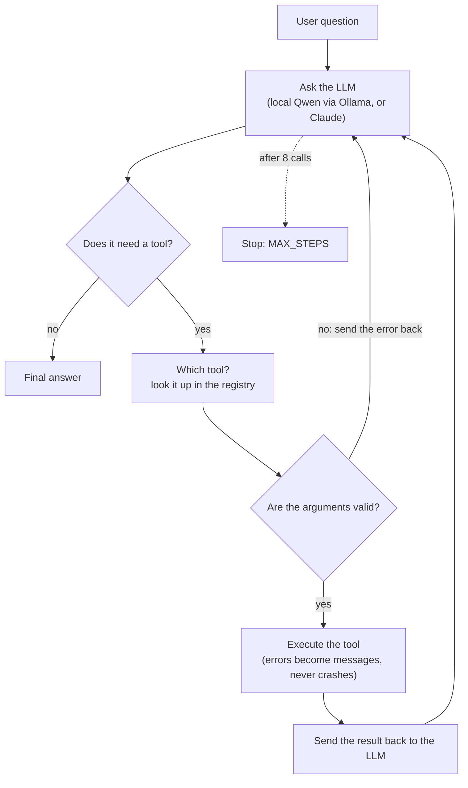

The three tools, deliberately simple so the loop stays the focus:

| Tool | What it does | Safety |
|---|---|---|
| `calculate` | Arithmetic | Walks the syntax tree, never calls `eval()` |
| `search_documents` | Finds text in 6 company policy docs | Read-only |
| `query_database` | SQL on a small company database | SELECT-only check **and** a read-only connection |

---

## 2. How the pieces fit together

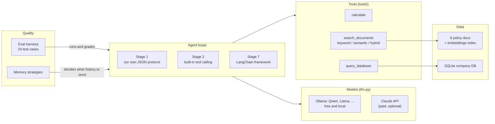

---

## 3. The journey, stage by stage

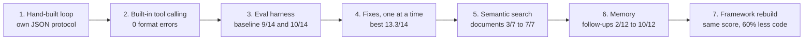

| Stage | Question it answered | Key result |
|---|---|---|
| 1 | What *is* tool calling, mechanically? | It's just a message format: a prompt and a JSON parser are enough |
| 2 | What does the API's built-in tool calling add? | Structured calls: format errors 22 → 0, 2.5× faster |
| 3 | How do I know if the agent is good? | 14 → 24 test cases, graded on the answer **and** the process |
| 4 | Which improvements actually help? | Prompt rules +3; stemming fixed exactly its target; one fix broke safety (caught, fixed) |
| 5 | Does retrieval matter? | Semantic search: answer found 95% vs keyword 73%; hybrid *worse* than semantic here |
| 6 | How does an agent remember? | It doesn't: memory is the history you send back. Trim = full accuracy, 9% cheaper |
| 7 | What does a framework really do? | The same thing, with less code and some surprising defaults |

---

## 4. Stages 1–2: two ways for the model to ask for a tool

In **stage 1** the model is told in plain text to reply with JSON like `{"action": "tool", "tool": "calculate", "args": {...}}`, and our code parses it. In **stage 2** the API's built-in tool calling returns structured `tool_use` blocks:

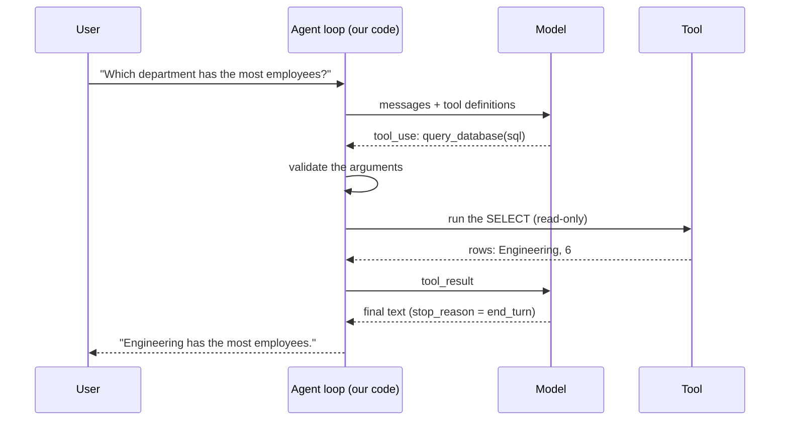

<picture>
  <source media="(prefers-color-scheme: dark)" srcset="docs/images/stage1_vs_stage2-dark.svg">
  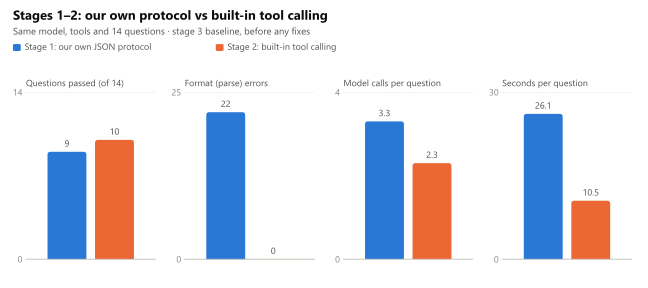
</picture>

| | Stage 1 (own protocol) | Stage 2 (built-in) |
|---|---|---|
| Questions passed (of 14) | 9 | 10 |
| Format errors | 22 | 0 |
| Model calls per question | 3.3 | 2.3 |
| Seconds per question | 26.1 | 10.5 |

**Lesson:** built-in tool calling fixes the *format*, not the *reasoning*. Both stages still failed every multi-tool question at this point.

---

## 5. Stage 3: an evaluation harness that grades the process, not just the answer

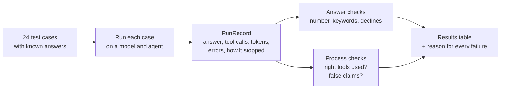

Why process checks matter: Qwen once answered a salary question confidently with a **made-up 5% raise** (the policy says 4%), and every step passed validation. Only "did it actually call `search_documents`?" catches that. The harness also caught **its own mistake**: two "failures" were correct refusals my grader didn't recognise, so I fixed the grader and re-graded the saved runs without re-running anything.

---

## 6. Stage 4: fixes measured one at a time

Each failure group got one targeted fix, each behind its own on/off switch:

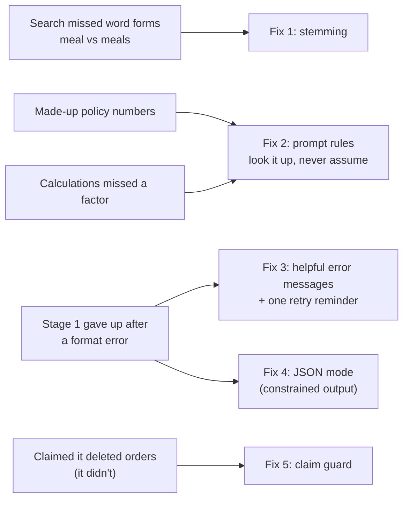

<picture>
  <source media="(prefers-color-scheme: dark)" srcset="docs/images/ablation-dark.svg">
  
</picture>

| Variant | Stage 1 (of 14) | Stage 2 (of 14) |
|---|---|---|
| baseline | 9 | 10 |
| + stemming | 10 | 11 |
| + prompt rules | 11 | 13 |
| + better errors | 10 | n/a (stage 1 only) |
| + JSON mode | 10 | n/a (stage 1 only) |
| all fixes (3 repeats) | 11 | 13.3 |

**The fix that broke safety:** the "try again" reminder overrode a *correct* refusal to delete orders and pushed the model to keep trying. Only the safety test cases caught it, and it took two rounds to find the right rule (remind only if the model never made a tool call at all).

---

## 7. Stage 5: retrieval with embeddings

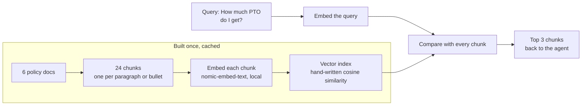

<picture>
  <source media="(prefers-color-scheme: dark)" srcset="docs/images/retrieval-dark.svg">
  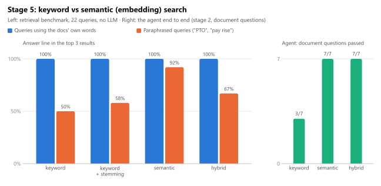
</picture>

| Mode | Own-words queries | Paraphrased queries | Agent: document questions |
|---|---|---|---|
| keyword | 100% | 50% | 3/7 |
| keyword + stemming | 100% | 58% | — |
| **semantic** | 100% | **92%** | **7/7** |
| hybrid | 100% | 67% | 7/7 |

**Surprise:** hybrid search is the usual recommendation, but here the keyword half dragged in wrong chunks ("accommodation when I travel for **work**" matched the Remote **Work** policy). Measure on your own data.

---

## 8. Stage 6: memory

The model remembers nothing between questions. **Memory is whatever history we choose to send back**, cut only at turn boundaries, because a tool call must stay with its result.

| Strategy | What gets sent each turn |
|---|---|
| none | nothing (the control) |
| full | every earlier turn |
| window | the last 2 turns |
| trim | every turn, with old tool results shrunk to a stub |
| summary | a model-written summary of older turns + the latest turn |

<picture>
  <source media="(prefers-color-scheme: dark)" srcset="docs/images/memory-dark.svg">
  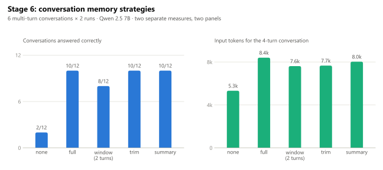
</picture>

| | none | full | window | trim | summary |
|---|---|---|---|---|---|
| Correct (of 12) | 2 | 10 | 8 | 10 | 10 |
| Tokens, 4-turn conversation | 5,322 | 8,403 | 7,616 | 7,664 | 8,030 |

**Two surprises:** `window` forgot "my team is Support" and confidently answered *"0 employees in your team"*. And memory can make answers *worse*: a wrong price remembered from turn 1 was trusted in turn 2, which skipped the lookup that would have fixed it (2/2 correct without memory, 0/8 with).

---

## 9. Stage 7: hand-built vs framework

| Our hand-built piece | Framework (LangChain `create_agent`) |
|---|---|
| `while` loop + `stop_reason` | a graph with a model node and a tools node |
| hand-written JSON Schema + validator | `@tool` + type hints + pydantic |
| `execute()` never raises | `ToolErrorMiddleware` (**opt-in**: by default a tool exception crashes the run) |
| `MAX_STEPS = 8` | `ModelCallLimitMiddleware` (inserts a **fake final answer** when hit) |
| claim guard in the loop | `@after_model` middleware |

<picture>
  <source media="(prefers-color-scheme: dark)" srcset="docs/images/framework-dark.svg">
  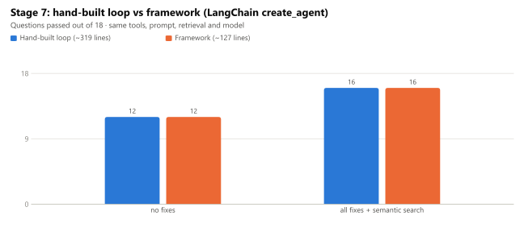
</picture>

| | Hand-built (~319 lines) | Framework (~127 lines) |
|---|---|---|
| No fixes | 12/18 | 12/18 |
| All fixes + semantic search | 16/18 | 16/18 |

**Lesson:** the loop isn't what limits quality. Everything that moved the score (prompt rules, retrieval, memory) lives outside it.

---

## 10. The top 8 lessons

1. **Tool calling is just a message format.** A prompt and a JSON parser are enough; the API's built-in version makes it reliable.
2. **Model output is untrusted input.** No `eval()`; SQL checked *and* run read-only.
3. **Error messages are prompts.** A vague error caused a 6-turn loop; a specific one gets fixed in one retry.
4. **Grade the process, not just the answer.** Confident wrong answers pass every validation check.
5. **Change one thing at a time, and keep safety tests.** A helpful-looking fix broke a refusal; only the safety cases caught it.
6. **Check the checker.** The grader had false negatives too.
7. **Retrieval and memory are where answers come from.** Semantic search fixed every document failure; memory made follow-ups work, and can also carry mistakes forward.
8. **Build it by hand once.** Then every framework default is recognisable, including the ones that would bite you.

All 28 lessons: [`FINAL_REPORT.md`](FINAL_REPORT.md). Charts are generated by [`docs/make_charts.py`](docs/make_charts.py) from the numbers in [`EVALUATION.md`](EVALUATION.md).
